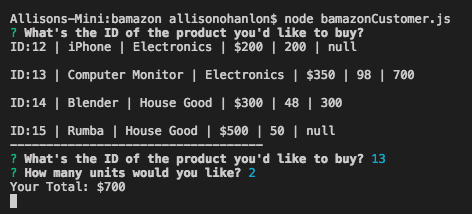

# bamazon

The app will take in orders from customers and deplete stock from the store's inventory. The app to tracks product sales across your store's departments and then provide a summary of the highest-grossing departments in the store.

**This application uses: Javascript, Node.js, mySQL**

Below is the the table and question that come up when you run bamazonCustomer. It shows all the items on sale and ask what is the id number of the item you'd like to purchase. Following the completion of that question, the next question for the quantity appears. The two give your total. In the background of this transaction, the mySQL table is adjusting the stock quantity of the items and storing the total product sales for each product. 

